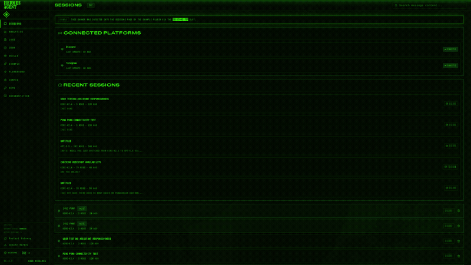

# Mainframe

A phosphor-green CRT dashboard theme for [Hermes Agent](https://github.com/NousResearch/hermes-agent).



---

**Mainframe** transforms the Hermes Agent web dashboard into an animated retro-futuristic terminal. This is not a subtle accent swap, it goes the extra mile to be large visual overhaul: phosphor green on space black, CRT scanlines, monospace typography, and animations that makes your interface feel like living 1970s hardware.

Built for the [Hermes Dashboard Theme Hackathon](https://x.com/Teknium/status/2047941621358928157).

---

## Features

### The CRT Animations

The interface is alive! Every animation is subtle enough to not distract, but present enough to notice:

| Effect | What it does | Interval |
|--------|-------------|----------|
| **Animated Scanlines** | Horizontal phosphor raster lines drift slowly upward across the entire viewport | 8s loop |
| **CRT Flicker** | Viewport-wide green/white micro-flashes simulate an old tube losing sync | 12s |
| **Roll Bar** | A horizontal phosphor brightness band sweeps top-to-bottom across the screen | 18s |
| **Cursor Blink** | A blinking underscore after every page heading (`SESSIONS_`) | 1.1s |

### Interactive Glow

- **Card Hover Bloom** - Cards lift 1px and erupt in green phosphor glow on hover
- **Active Nav Pulse** - The current page tab breathes with swelling text-shadow and border glow
- **Nav Link Hover** - Any sidebar link you hover gets a phosphor bloom and brightens
- **Button Intensify** - Buttons glow on hover and depress with a satisfying `scale(0.98)` on click
- **Chart Bar Hover** - Analytics bars brighten 30% on hover
- **Table Row Hover** - Rows light up with a subtle green wash
- **Phosphor Selection** - Text selection is green-tinted with glow

### Color Palette

| Token | Value | Usage |
|-------|-------|-------|
| Background | `#000800` | Backdrop and accent color |
| Midground | `#33ff00` | Primary text, borders, phosphor glow |
| Accent | `#00e5ff` | Secondary highlights, chart output bars |
| Warning | `#ffb000` | Alerts that need to stand out |
| Warm Glow | `rgba(51, 255, 0, 0.08)` | Subtle green vignette |

---

## Installation

### One-line install

```bash
curl -fsSL https://raw.githubusercontent.com/TabooHarmony/hermes-mainframe-theme/main/mainframe.yaml -o ~/.hermes/dashboard-themes/mainframe.yaml
curl -s http://127.0.0.1:9119/api/dashboard/plugins/rescan
```

### Manual install

1. Download `mainframe.yaml` from this repository.
2. Drop it into `~/.hermes/dashboard-themes/`.
3. Hit the rescan endpoint:
   ```bash
   curl -s http://127.0.0.1:9119/api/dashboard/plugins/rescan
   ```
4. Open the dashboard, click **Switch theme**, and select **Mainframe**.

### Requirements

- Hermes Agent >= v0.11.0
- A modern browser (Chrome, Firefox, Edge, Safari)
- Internet access (for Google Fonts: VT323)

---

## Customization

The theme is a single YAML file. All aesthetic logic lives in `customCSS`. Key values you might want to tweak:

- **Scanline opacity** - Search for `rgba(51, 255, 0, 0.04)` in the scanlines block and adjust the alpha
- **Glow intensity** - Modify the `text-shadow` values in the phosphor glow section
- **Animation speeds** - Change the `animation:` durations (currently 8s, 12s, 18s)
- **Colors** - Edit the `palette` and `colorOverrides` sections at the top of the YAML

---

## License

MIT | Do whatever you want. If you make it better, send a PR, thanks!

---

*Built with phosphor and spite by [@TabooHarmony](https://github.com/TabooHarmony) for the Hermes community.*
